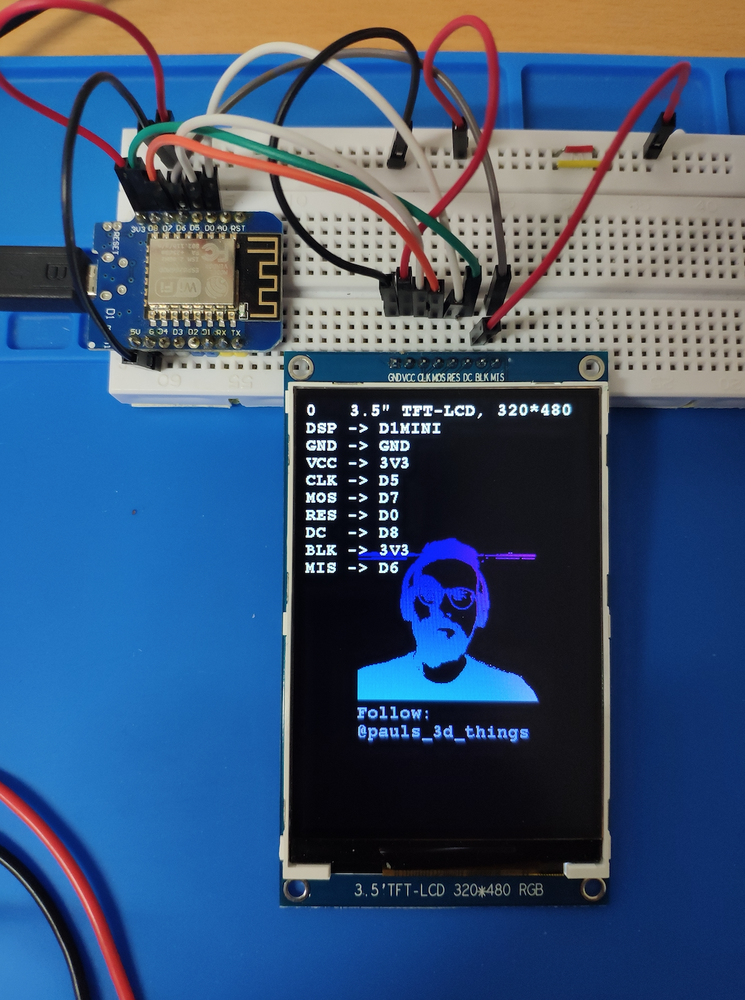

# ILI9486 on Wemos D1mini

You will need
- the display [from aliexpress](https://www.aliexpress.com/item/NoEnName-Null-3-5-inch-8P-SPI-TFT-LCD-Color-Screen-Module-ILI9486-Drive-IC-320/32828584257.html)
- a wemos d1 mini  [from aliexpress](https://www.aliexpress.com/item/ESP8266-ESP-12-ESP-12F-CH340G-CH340-V2-USB-WeMos-D1-Mini-WIFI-Development-Board-D1/32674463823.html)
- the [ucglib library](https://github.com/olikraus/ucglib/wiki/reference) (install via arduino)

Connections:

| Display |  D1mini |
| --- | --- |
| GND | GND |
| VCC | 3V3 |
| CLK | D5 | 
| MOS | D7 | 
| RES | D0 | 
| DC  | D8 | 
| BLK | 3V3| 
| MIS | D6 | 

Result:

